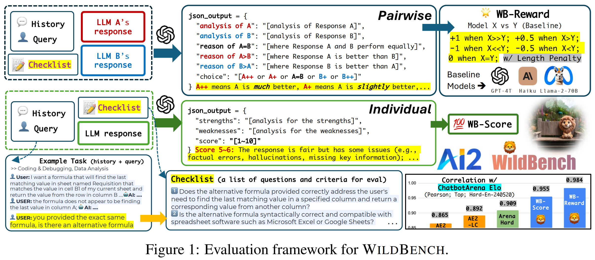
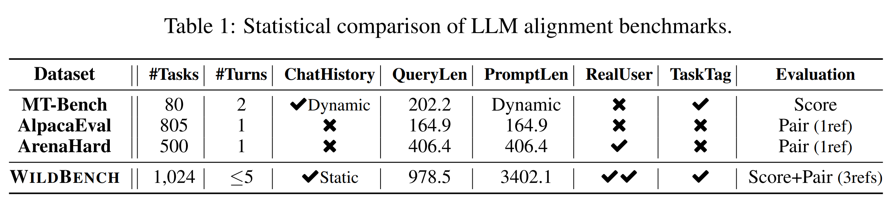
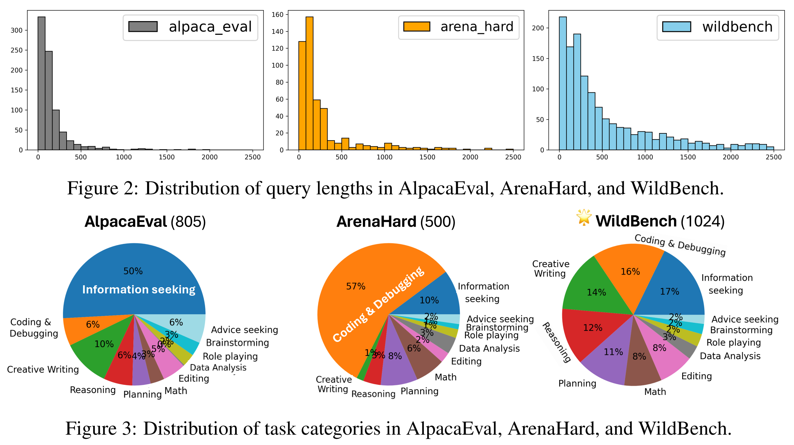
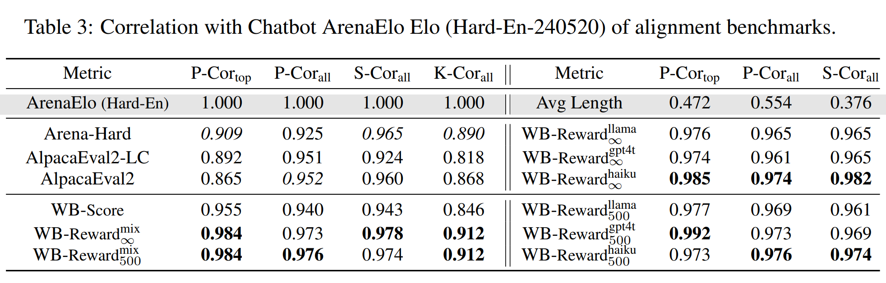

# 🦁 WildBench: Benchmarking LLMs with Challenging Tasks from Real Users in the Wild (v2)

<div style="display: flex; justify-content: flex-start;"> </div>

## Intro
[📑 Paper](https://allenai.github.io/WildBench/WildBench_paper.pdf) | [🤗 Leaderboard](https://huggingface.co/spaces/allenai/WildBench) & [🤗 Dataset](https://huggingface.co/datasets/allenai/WildBench)


### Evaluation Framework
<details>
  <summary>Click to expand</summary>

  

</details>

### Dataset Overview
<details>
  <summary>Click to expand</summary>

  
  

</details>


## How to add a new model to 🦁 WildBench benchmark 

> [!NOTE]
> If your model is on HuggingFace and/or it is supported by [vLLM](https://github.com/vllm-project/vllm), please create an **Issue** here to tell us your model id, chat template, and your preferred sampling parameters. We will add the script to run your model to the repo here and run inference and evaluation for you.

If you'd like to try to run inference on your model by yourself or you'd like to create a PR for adding your model here, you can follow the instructions below. 


### Installation

<!-- 
conda create -p /net/nfs/mosaic/yuchenl/envs/wbnfs python=3.10 
conda activate /net/nfs/mosaic/yuchenl/envs/wbnfs
-->
```bash
conda create -n wildbench python=3.10
conda activate wildbench
pip install vllm -U # pip install -e vllm 
pip install openai datasets tenacity
pip install google-generativeai
pip install cohere mistralai 
pip install anthropic==0.19.0
pip install reka-api==3.0.8
# export HF_HOME=/path/to/your/custom/cache_dir/
```

<!-- 
pip install vllm==0.3.1
pip install openai==0.28.0
pip install datasets tenacity

export HF_HOME=/net/nfs/climate/tmp_cache/
 -->


### Shortcut to run a model

```bash
bash scripts/_common_vllm.sh m-a-p/neo_7b_instruct_v0.1 neo_7b_instruct_v0.1 4 
# 1st arg is hf_name; 2nd is the pretty name; 3rd is the number of shards (gpus)
```

### Longer versions ⬇️

<details>
	<summary>  
<b> Case 1: Models supported by vLLM</b>
    </summary>

You can take the files under `scripts` as a reference to add a new model to the benchmark, for example, to add `Yi-1.5-9B-Chat.sh` to the benchmark, you can follow the following steps:
1. Create a script named "Yi-1.5-9B-Chat.sh.py" under `scripts` folder.
2. Copy and paste the most similar existing script file to it, rename the file to the `[model_pretty_name].sh`.
3. Change the `model_name` and `model_pretty_name` to `01-ai/Yi-1.5-9B-Chat` and `Yi-1.5-9B-Chat.sh` respectively. Make sure that `model_name` is the same as the model name in the Hugging Face model hub, and the `model_pretty_name` is the same as the script name without the `.py` extension.
4. Specify the conversation template for this model by modifying the code in `src/fastchat_conversation.py` or setting the `--use_hf_conv_template` argument if your hugingface model contains a conversation template in tokenizer config.
5. Run your script to make sure it works. You can run the script by running `bash scripts/Yi-1.5-9B-Chat.sh` in the root folder. 
6. Create a PR to add your script to the benchmark.


For Step 3-5, you can also use the above shortcut common command to run the model if your model is supported by vLLM and has a conversation template on hf's tokenizer config.

</details>


<details>
	<summary> Case 2: Models that are only supported by native HuggingFace API </summary>


Some new models may not be supported by vLLM for now. You can do the same thing as above but use `--engine hf` in the script instead, and test your script. Note that some models may need more specific configurations, and you will need to read the code and modify them accordingly. In these cases, you should add name-checking conditions to ensure that the model-specific changes are only applied to the specific model.


</details>


<details>
    <summary> Case 3: Private API-based Models </summary>


You should change the code to add these APIs, for example, gemini, cohere, claude, and reka. You can refer to the `--engine openai` logic in the existing scripts to add your own API-based models. Please make sure that you do not expose your API keys in the code. If your model is on Together.AI platform, you can use the `--engine together` option to run your model, see `scripts/dbrx-instruct@together.sh` for an example.


</details>


## Evaluation 


> [!NOTE]
> If you'd like to have your model results verified and published on our leaderboard, please create an issue telling us and we'll do the inference and evaluation for you. 

### Metrics

<details>
    <summary style="font-weight: bold;">How do you evaluate the performance of LLMs on WildBench? （V2 Updates)</summary>
    <div style="font-size: 1.2em; margin-top: 30px;">
        <h4>Checklists </h4> 
        For each task in WildBench (v2), we generate a checklist of 5-10 questions by prompting GPT-4-turbo and Claude-3-Opus to comprehensively evaluate the responses of different models. The checklist is example-specific and is designed to be interpretable and easy to verify. We combine the responses of GPT-4-turbo and Claude-3-Opus to finalize the checklists to reduce the bias of a single evaluator. 
        These checklists are used as part of the prompts for LLM judges to evaluate the responses of different models.
        <h4>WB Score</h4> 
        To individually evaluate the performance of each model on WildBench, we prompt GPT-4-turbo to give a score form 1 to 10 for each model's response. The WB score is the average of the scores on 1024 examples, and re-scaled by (Y-5)*2, where Y is the original score outputted by GPT-4-turbo. Note that 5 represents that a response is boderline acceptable. 
        <h4>WB Reward</h4> 
        To evaluate two models (A and B) on a certain task of WildBench, we prompt GPT-4-turbo to choose the better response between two models. There are five choices: A is much/worse than B, A is slightly better/worse than B, and Tie.
        We define WB reward for Model A as follows:
        <ul>
        <li> Reward=<b>100</b> if the A is <b>much better</b> than B.</li>
        <li> Reward=<b>50</b> if the A is <b>slightly better</b> than B.</li>
        <li> Reward=<b>0</b> if there is a <b>Tie</b>.</li>
        <li> Reward=<b>-50</b> if the A is <b>slightly worse</b> than B.</li>
        <li> Reward=<b>-100</b> if the A is <b>much worse</b> than B.</li>
        </ul>
        We use three reference models (GPT-4-turbo-0429, Claude-3-Haiku, and Llama-2-70B-chat) to compute the rewards for each model. The final WB Reward-Mix is the average of the three rewards on 1024 examples.
        <h4>Mitigating Length Bias</h4>  
        As many studies have shown, LLM judges tend to prefer longer responses. To mitigate this bias, we propose a simple and customizable length penalty method. <b>We convert Slightly Win/Lose to be a Tie if the winner is longer than the loser by a certain length threshold (K characters).</b>  Note that <b>K= ∞ will disable the length penalty.</b>
    </div>
</details>

### ‼️ Run evaluation scripts 

We suggest to use OpenAI's [Batch Mode](https://platform.openai.com/docs/guides/batch) for evaluation, which is faster, cheaper and more reliable. 

You can:
- 1. Run `bash evaluation/run_all_eval_batch.sh ${MODEL_PRETTY_NAME}`to submmit the eval jobs.; Or if you only want to do scoring, running `bash evaluation/run_score_eval_batch.sh` to submmit the eval jobs for only doing the WB Score. (about $5 per model)
- 2. Run `python src/openai_batch_eval/check_batch_status_with_model_name.py ${MODEL_PRETTY_NAME}` to track the status of the batch jobs.
- 3. Step 2 will download the results when batch jobs are finished, and then you can view the results (see next section).

***Remarks***
- `${MODEL_PRETTY_NAME}` should be the same as the script name without the `.sh` extension.
- You can also track the progress of your batch jobs here: [https://platform.openai.com/batches](https://platform.openai.com/batches). The maximum turnaround time is 24 hours, but it is usually much faster depending on the queue and rate limits. 
- If you'd like to have more control on the evaluation methods, the detail steps are illustrated in [EVAL.md](EVAL.md).


### View the results

When Step 3 in the above section is finished, you can view the results by running the following commands:

<!-- 
- WB Score: `python src/view_wb_eval.py score`
- WB Reward on GPT-4-turbo: `python src/view_wb_eval.py pairwise-gpt4t 500`
- WB Reward on Claude-3-Haiku: `python src/view_wb_eval.py pairwise-haiku 500`
- WB Reward on Llama-2-70b-chat: `python src/view_wb_eval.py pairwise-llama 500`

The 2nd argument is `K`, the length margin for the length penalty. You can set it to -1 or leave it empty to disable the length penalty. -->

```bash
bash leaderboard/show_eval.sh # run all and show the main leaderboard
python leaderboard/show_table.py --mode main  # (optional) to show the main leaderboard w/o recomputing 
python leaderboard/show_table.py --mode taskwise_score # (optional) to show the taskwise score
```


## Correlation Analysis: How well does WildBench (v2) correlate with human preferences?
To analyze the correlation between WildBench (v2) and human evaluation, we consider the correlation between different metrics and human-based Chatbot Arena Elo scores (until 2024-05-20 on Hard-English split).  We find that the WB Reward-Mix has the highest correlation. Please find the pearson correlation coefficients below:
 


- Top Models: `['gpt-4-turbo-2024-04-09', 'claude-3-opus-20240229', 'Meta-Llama-3-70B-Instruct', 'claude-3-sonnet-20240229', 'mistral-large-2402', 'Meta-Llama-3-8B-Instruct']`
- All Models: `['gpt-4-turbo-2024-04-09', 'claude-3-opus-20240229', 'Meta-Llama-3-70B-Instruct', 'Qwen1.5-72B-Chat', 'claude-3-sonnet-20240229', 'mistral-large-2402', 'dbrx-instruct@together', 'Mixtral-8x7B-Instruct-v0.1', 'Meta-Llama-3-8B-Instruct', 'tulu-2-dpo-70b', 'Llama-2-70b-chat-hf', 'Llama-2-7b-chat-hf', 'gemma-7b-it', 'gemma-2b-it']`


## Todos

### Models pending to test 

- [ ] LLM360/K2-Chat
- [x] DeepSeek-V2-Code
- [x] Yi-large-preview
- [x] THUDM/glm-4-9b-chat
- [x] chujiezheng/neo_7b_instruct_v0.1-ExPO
- [x] ZhangShenao/SELM-Llama-3-8B-Instruct-iter-3 
- [x] m-a-p/neo_7b_instruct_v0.1
- [x] Reka Flash
- [x] DeepSeekV2-Chat
- [x] Reka Core
- [x] Yi-Large (via OpenAI-like APIs)
- [x] chujiezheng/Llama-3-Instruct-8B-SimPO-ExPO
- [x] chujiezheng/Starling-LM-7B-beta-ExPO
- [x] Gemini 1.5 series
- [x] Qwen2-72B-Instruct
- [x] ZhangShenao/SELM-Zephyr-7B-iter-3
- [x] NousResearch/Hermes-2-Theta-Llama-3-8B
- [x] princeton-nlp/Llama-3-Instruct-8B-SimPO   
- [x] Command-R-plus
- [x] Phi-3 series

Create an Issue if you'd like to add a model that you wanna see on our leaderboard!

### Code updates

- [ ] support models via openai-style apis

### Leadeboard updates

- [ ] Show task categorized results  


## Citation

```bibtex
@misc{lin2024wildbench,
    title={WildBench: Benchmarking LLMs with Challenging Tasks from Real Users in the Wild},
    author={Bill Yuchen Lin and Yuntian Deng and Khyathi Chandu and Faeze Brahman and Abhilasha Ravichander and Valentina Pyatkin and Nouha Dziri and Ronan Le Bras and Yejin Choi},
    year={2024},
    eprint={2406.04770},
    archivePrefix={arXiv},
    primaryClass={cs.CL},
    url={https://arxiv.org/abs/2406.04770}
}
```


<!-- 


bash scripts/_common_vllm.sh ZhangShenao/SELM-Llama-3-8B-Instruct-iter-3 SELM-Llama-3-8B-Instruct-iter-3 4 
bash scripts/_common_vllm.sh THUDM/glm-4-9b-chat glm-4-9b-chat 4 
bash scripts/_common_vllm.sh LLM360/K2-Chat K2-Chat 1 
bash scripts/_common_vllm.sh chujiezheng/neo_7b_instruct_v0.1-ExPO neo_7b_instruct_v0.1-ExPO 4


python src/upload_results.py gemini-1.5-flash
python src/upload_results.py gemini-1.5-pro
python src/upload_results.py Qwen2-72B-Instruct
python src/upload_results.py Llama-3-Instruct-8B-SimPO-ExPO
python src/upload_results.py Starling-LM-7B-beta-ExPO
python src/upload_results.py Qwen1.5-72B-Chat-greedy
python src/upload_results.py yi-large 
python src/upload_results.py reka-flash-20240226
python src/upload_results.py deepseekv2-chat
python src/upload_results.py reka-edge
python src/upload_results.py reka-core-20240501
python src/upload_results.py neo_7b_instruct_v0.1
python src/upload_results.py SELM-Llama-3-8B-Instruct-iter-3
python src/upload_results.py glm-4-9b-chat
python src/upload_results.py neo_7b_instruct_v0.1-ExPO
python src/upload_results.py deepseek-coder-v2
python src/upload_results.py yi-large-preview
python src/upload_results.py nemotron-4-340b-instruct
python src/upload_results.py claude-3-5-sonnet-20240620

### Submit Batch Jobs
bash evaluation/run_all_eval_batch.sh command-r-plus
bash evaluation/run_all_eval_batch.sh Hermes-2-Theta-Llama-3-8B
bash evaluation/run_all_eval_batch.sh Llama-3-Instruct-8B-SimPO
bash evaluation/run_all_eval_batch.sh Phi-3-mini-128k-instruct
bash evaluation/run_all_eval_batch.sh Phi-3-medium-128k-instruct
bash evaluation/run_all_eval_batch.sh SELM-Zephyr-7B-iter-3
bash evaluation/run_all_eval_batch.sh Qwen2-72B-Instruct
bash evaluation/run_all_eval_batch.sh gemini-1.5-flash
bash evaluation/run_all_eval_batch.sh gemini-1.5-pro
bash evaluation/run_all_eval_batch.sh Llama-3-Instruct-8B-SimPO-ExPO
bash evaluation/run_all_eval_batch.sh Starling-LM-7B-beta-ExPO
bash evaluation/run_all_eval_batch.sh Qwen1.5-72B-Chat-greedy
bash evaluation/run_all_eval_batch.sh yi-large
bash evaluation/run_all_eval_batch.sh reka-flash-20240226
bash evaluation/run_all_eval_batch.sh deepseekv2-chat
bash evaluation/run_all_eval_batch.sh reka-edge
bash evaluation/run_all_eval_batch.sh reka-core-20240501
bash evaluation/run_all_eval_batch.sh neo_7b_instruct_v0.1
bash evaluation/run_all_eval_batch.sh SELM-Llama-3-8B-Instruct-iter-3
bash evaluation/run_all_eval_batch.sh glm-4-9b-chat
bash evaluation/run_all_eval_batch.sh deepseek-coder-v2
bash evaluation/run_all_eval_batch.sh neo_7b_instruct_v0.1-ExPO
bash evaluation/run_all_eval_batch.sh yi-large-preview
bash evaluation/run_all_eval_batch.sh nemotron-4-340b-instruct
bash evaluation/run_all_eval_batch.sh claude-3-5-sonnet-20240620

### Submit Score-only Batch Jobs
bash evaluation/run_score_eval_batch.sh neo_7b_instruct_v0.1-ExPO

### Check Batch Status
python src/openai_batch_eval/check_batch_status_with_model_name.py command-r-plus
python src/openai_batch_eval/check_batch_status_with_model_name.py Hermes-2-Theta-Llama-3-8B
python src/openai_batch_eval/check_batch_status_with_model_name.py Llama-3-Instruct-8B-SimPO
python src/openai_batch_eval/check_batch_status_with_model_name.py Phi-3-mini-128k-instruct
python src/openai_batch_eval/check_batch_status_with_model_name.py Phi-3-medium-128k-instruct
python src/openai_batch_eval/check_batch_status_with_model_name.py SELM-Zephyr-7B-iter-3
python src/openai_batch_eval/check_batch_status_with_model_name.py Qwen2-72B-Instruct
python src/openai_batch_eval/check_batch_status_with_model_name.py gemini-1.5-flash
python src/openai_batch_eval/check_batch_status_with_model_name.py gemini-1.5-pro
python src/openai_batch_eval/check_batch_status_with_model_name.py Llama-3-Instruct-8B-SimPO-ExPO
python src/openai_batch_eval/check_batch_status_with_model_name.py Starling-LM-7B-beta-ExPO
python src/openai_batch_eval/check_batch_status_with_model_name.py Qwen1.5-72B-Chat-greedy
python src/openai_batch_eval/check_batch_status_with_model_name.py yi-large
python src/openai_batch_eval/check_batch_status_with_model_name.py reka-flash-20240226
python src/openai_batch_eval/check_batch_status_with_model_name.py deepseekv2-chat
python src/openai_batch_eval/check_batch_status_with_model_name.py reka-edge
python src/openai_batch_eval/check_batch_status_with_model_name.py reka-core-20240501
python src/openai_batch_eval/check_batch_status_with_model_name.py neo_7b_instruct_v0.1
python src/openai_batch_eval/check_batch_status_with_model_name.py SELM-Llama-3-8B-Instruct-iter-3
python src/openai_batch_eval/check_batch_status_with_model_name.py glm-4-9b-chat
python src/openai_batch_eval/check_batch_status_with_model_name.py deepseek-coder-v2
python src/openai_batch_eval/check_batch_status_with_model_name.py neo_7b_instruct_v0.1-ExPO

python src/openai_batch_eval/check_batch_status_with_model_name.py yi-large-preview
python src/openai_batch_eval/check_batch_status_with_model_name.py nemotron-4-340b-instruct
python src/openai_batch_eval/check_batch_status_with_model_name.py claude-3-5-sonnet-20240620

# python src/view_wb_eval.py score
# python src/view_wb_eval.py pairwise-gpt4t -1
# python src/view_wb_eval.py pairwise-haiku -1
# python src/view_wb_eval.py pairwise-llama -1


bash leaderboard/show_eval.sh 
bash leaderboard/show_eval.sh score_only

python leaderboard/show_table.py --mode main
python leaderboard/show_table.py --mode taskwise_score

-->


<!-- 

### For Magpie evaluaiton 
bash evaluation/run_score_eval_batch.sh Magpie-Pro-SFT-v0.1
python src/openai_batch_eval/check_batch_status_with_model_name.py Magpie-Pro-SFT-v0.1
python src/view_wb_eval.py score

bash evaluation/run_haiku_eval_batch.sh Magpie-Pro-SFT-v0.1
python src/openai_batch_eval/check_batch_status_with_model_name.py Magpie-Pro-SFT-v0.1


bash evaluation/run_score_eval_batch.sh Llama-3-8B-WildChat
python src/openai_batch_eval/check_batch_status_with_model_name.py Llama-3-8B-WildChat
python src/view_wb_eval.py score


bash evaluation/run_score_eval_batch.sh Llama-3-8B-Tulu-330K
python src/openai_batch_eval/check_batch_status_with_model_name.py Llama-3-8B-Tulu-330K
python src/view_wb_eval.py score


bash scripts/Llama-3-8B-Tulu-330K.sh 
wait 
bash scripts/Llama-3-8B-OpenHermes-243K.sh 
wait 
bash scripts/Llama-3-8B-Ultrachat-200K.sh
wait 
bash scripts/Llama-3-8B-WizardLM-196K.sh
wait 
bash scripts/Llama-3-8B-ShareGPT-112K.sh
wait 


bash evaluation/run_score_eval_batch.sh Llama-3-8B-OpenHermes-243K
bash evaluation/run_score_eval_batch.sh Llama-3-8B-Ultrachat-200K
bash evaluation/run_score_eval_batch.sh Llama-3-8B-WizardLM-196K
bash evaluation/run_score_eval_batch.sh Llama-3-8B-ShareGPT-112K


python src/openai_batch_eval/check_batch_status_with_model_name.py Llama-3-8B-OpenHermes-243K
python src/openai_batch_eval/check_batch_status_with_model_name.py Llama-3-8B-Ultrachat-200K
python src/openai_batch_eval/check_batch_status_with_model_name.py Llama-3-8B-WizardLM-196K
python src/openai_batch_eval/check_batch_status_with_model_name.py Llama-3-8B-ShareGPT-112K
 -->